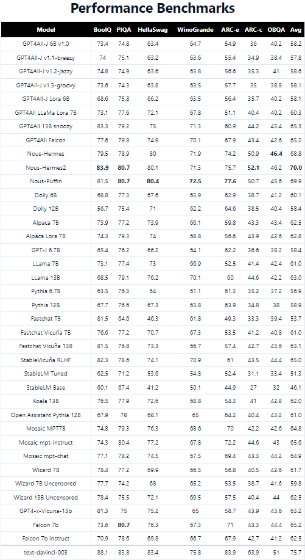

# 💬 CPU_AI_Telegram-Messange

**AI Chatbot with Multifunctionalities**

This is a versatile AI chatbot with various functionalities, including text-to-speech, chat capabilities, summarization of text, audio, and YouTube videos, speech enhancement, and more. You can use this bot to interact with AI models and perform various tasks. This code needs to work with wifi and telegram, but every model works offline so I hope to create an offline alternative. Everything runs on cpu but it can run on gpu with a few adjustments.
NOTE: If you want to correct and optimize the code or add implementation please do I would appreciate very much, contact me if you do so we can add it to this repository.😊 Please If you want to integrate something make it so it is not dependant on api's or services that cost. Help me implement a way so the ai can search the web and give accurate response based on internet results.🌐

### 📚 Citations and Special Thanks

We would like to express our gratitude to the creators and contributors of the following repositories and models, which have greatly enhanced the functionality of this project. 🙏

- [nomic-ai/gpt4all](https://github.com/nomic-ai/gpt4all): 🧠 State-of-the-art AI models.
  - We would like to thank the Nomic AI team for their pioneering work in the field of AI models. This project benefits from their groundbreaking research and contributions.

- [openai/whisper-large-v2](https://huggingface.co/openai/whisper-large-v2): 🎙️ OpenAI's Whisper for speech recognition.
  - Our chatbot leverages OpenAI's Whisper model for accurate and reliable speech recognition. We extend our appreciation to OpenAI for their invaluable resource.

- [snakers4/silero-models](https://github.com/snakers4/silero-models): 🗣️ Silero's multilingual ASR models.
  - Special thanks to the Silero team for developing multilingual ASR models that enhance our chatbot's speech processing capabilities.

- [facebook/bart-large-cnn](https://huggingface.co/facebook/bart-large-cnn): 📰 Facebook's BART for summarization.
  - We are indebted to Facebook for their BART model, which enables the chatbot to summarize text and news articles effectively.

- [imartinez/privateGPT](https://github.com/imartinez/privateGPT): 🔐 Private and secure AI models.
  - We extend our appreciation to imartinez for their work on private AI models. This project benefits from their commitment to user privacy and security.

We are grateful to these creators and organizations for making their resources available to the open-source community, enriching the capabilities of our AI chatbot. Without their contributions, this project would not be as powerful and versatile as it is today. 🌟

Please consider exploring these repositories and models to learn more about their individual features and benefits. Feel free to contribute to their development and show your support for the open-source community.

Do note that each repository or model may have its own licensing terms and requirements, so make sure to review and comply with their respective licenses.

## 🚀 Getting Started

These instructions will help you set up and run the AI chatbot on your system.

### Download Git

Before you start, make sure you have Git installed on your system. If you don't have it, you can download Git from the official website: [Download Git](https://git-scm.com/downloads)🔧.

### Prerequisites

- Before you begin, make sure you have Python 3.x (suggested 3.10) installed on your system. 

- `git clone https://github.com/dave111111111/CPU_AI_Telegram.git`

-  cd into the cloned folder`cd CPU_AI_Telegram`

- You will also need to install the required Python packages. To install them, run the following command: `pip install -r requirements.txt`.

# How to Create a Telegram Bot and Obtain the Token

Follow these steps to create a Telegram bot and obtain the token necessary for your bot development:

## Step 1: Set Up a Telegram Account

If you don't already have one, create a Telegram account.

## Step 2: Open Telegram and Search for BotFather

- Open the Telegram app.
- In the search bar at the top, type `BotFather.`
- You will see a user with the name "BotFather" and a blue checkmark. This is the official Telegram bot for creating other bots.

## Step 3: Start a Chat with BotFather

- Click on the "BotFather" user to start a chat.
- Click the "Start" button or send the command "/start" to initiate a chat with BotFather.

## Step 4: Create a New Bot

- To create a new bot, send the command `/newbot` to BotFather.

## Step 5: Choose a Name and Username

- BotFather will ask you to choose a name for your bot. This name can be anything you like.
- Next, you will need to choose a username for your bot. The username must be unique and end with "bot" (e.g., "mytestbot" or "awesome_bot_bot"). BotFather will let you know if the username is available.

## Step 6: Obtain Your Token

- After successfully creating your bot, BotFather will provide you with a unique API token. This token is essential for your bot to communicate with the Telegram API.

## Step 7: Save Your Token

- It's crucial to save your API token in a secure place. You'll need this token to configure your bot.

## Step 8: Configure Your Bot

- Use the API token you obtained from BotFather to configure your bot in your code. Insert the token in the designated place in your code.

And that's it! You've created a Telegram bot and obtained the token to use in your bot code. Now you can integrate your bot with the Telegram platform and start building its functionalities.

Feel free to use this guide in your GitHub README to help others create their Telegram bots and obtain API tokens.

### Download LLM

To download the model the code will automatically start to download them from the gpt4all and TTS github when the `python chatbot.py` file is started but, they OCCUPY MUCH SPACE, so # out some links of site, infact the most heavy files are the llms models and all of them are 69gb while the tts model only 357mb This is the python file `download.py`.

Here is the code to download only the most important model:
`
    gpt4all_urls  = [
        #"https://gpt4all.io/models/wizardlm-13b-v1.1-superhot-8k.ggmlv3.q4_0.bin",
        #"https://huggingface.co/nomic-ai/gpt4all-falcon-ggml/resolve/main/ggml-model-gpt4all-falcon-q4_0.bin",
        #"https://huggingface.co/TheBloke/Nous-Hermes-13B-GGML/resolve/main/nous-hermes-13b.ggmlv3.q4_0.bin",
        "https://huggingface.co/TheBloke/GPT4All-13B-snoozy-GGML/resolve/main/GPT4All-13B-snoozy.ggmlv3.q4_0.bin",
        #"https://huggingface.co/TheBloke/orca_mini_7B-GGML/resolve/main/orca-mini-7b.ggmlv3.q4_0.bin",
        #"https://huggingface.co/TheBloke/orca_mini_3B-GGML/resolve/main/orca-mini-3b.ggmlv3.q4_0.bin",
        #"https://huggingface.co/TheBloke/orca_mini_13B-GGML/resolve/main/orca-mini-13b.ggmlv3.q4_0.bin",
        #"https://huggingface.co/TheBloke/WizardLM-13B-Uncensored-GGML/resolve/main/wizardLM-13B-Uncensored.ggmlv3.q4_0.bin",
        #"https://huggingface.co/nomic-ai/ggml-replit-code-v1-3b/resolve/main/ggml-replit-code-v1-3b.bin",
        #"https://gpt4all.io/models/ggml-all-MiniLM-L6-v2-f16.bin",
        #"https://gpt4all.io/models/starcoderbase-3b-ggml.bin",
        #"https://gpt4all.io/models/starcoderbase-7b-ggml.bin",
        #"https://huggingface.co/TheBloke/Llama-2-7B-Chat-GGML/resolve/main/llama-2-7b-chat.ggmlv3.q4_0.bin"
    ]
`

### Value your model

These are the model you can use and these are the benchmarks:

# Model Selection for Your Project

Choosing the right model is a crucial decision for your project. It determines the capabilities and functionality of your application. In this README, we'll help you understand the rationale behind selecting a model that aligns with your project's goals.

## Model Options

### BoolQ
- **Use for:** Yes/No question-answering tasks.
- **Rationale:** BoolQ excels at simple binary classification based on text input. Ideal for straightforward natural language understanding tasks.

### PIQA
- **Use for:** Visual question-answering tasks, especially those involving images.
- **Rationale:** PIQA is designed to evaluate models on questions related to visual information, such as images or scenes.

### HellaSwag
- **Use for:** Tasks requiring complex commonsense reasoning and world knowledge.
- **Rationale:** HellaSwag presents a challenge for models to exhibit advanced reasoning capabilities.

### WinoGrande
- **Use for:** Coreference resolution and handling ambiguous pronouns in text.
- **Rationale:** WinoGrande focuses on specific aspects of natural language understanding related to coreference.

### ARC-e and ARC-c
- **Use ARC-e for:** Scientific reasoning tasks.
- **Use ARC-c for:** General knowledge-based tasks.
- **Rationale:** Choose the appropriate subset based on the domain of your project.

### OBQA
- **Use for:** Comprehension of elementary school textbook passages and questions.
- **Rationale:** Ideal for educational or text-based tasks.

### Avg
- **Use for:** Summarizing model performance across multiple tasks or datasets.
- **Rationale:** Useful for presenting an overall evaluation of models in various contexts.

## Making the Right Choice

Select a model that aligns with your project's primary objectives. Your choice will significantly impact the functionality and capabilities of your application. Carefully assess your project's requirements and goals to make an informed decision.

Feel free to explore the models mentioned above and their specific use cases. Understanding their strengths will help you choose the model that best suits your project's needs.

### Running the Chatbot

To start the chatbot, use the following command `python chatbot.py`.

## 💡 Functionalities

### Text-to-Speech (TTS)

You can convert text into lifelike speech using the `/tts` command. Customize the voice by choosing the language and speaker.

💬 Chat Command:
To chat with the bot, use the `/chat` command followed by your message. For instance, you can send `/chat what is Wikipedia?` to start a chat with the bot. You can also send PDF or TXT documents to the bot for discussion; it will process them and respond to your questions. To chat with files, use the `/chat_with_files` command followed by a question related to the files.

📃 Summarize Text Command:
Use the `/summarize_text` command to summarize text. Specify the minimum and maximum percentage of the summary along with the text you want to summarize.

🎙️ Summarize Audio Command:
The `/summarize_audio` command allows you to transcribe and summarize audio files. Provide the file name, language, and desired summary percentage.

📺 Summarize YouTube Video Command:
Summarize YouTube videos with the `/summarize_yt_video` command. Provide the video link, language, and summary percentages.

🎙️ Speech Enhancement Command:
Improve audio quality by uploading your audio file and using the `/speech_enhancement` command.

🗑️ Clean Files Command:
Use the `/clean_files` command to remove files you've sent to the bot.

🤖 Chat with Models:
Chat with AI models by using the "/chat" command followed by your message.

💬 Chat with Embeddings:
For more advanced chat capabilities, use the `/chat_with_files` command followed by your message.

📁 File Management:

The chatbot can handle various file types, such as PDF and TXT documents, for summarization and conversation.

🆘 Support:
If you encounter any issues or have questions, feel free to [create an issue](https://github.com/CPU_AI_Telegram-Messange/issues) or [contact us](mailto:bonnie.dido@gmail.com).

📄 License:

This project is licensed under the MIT License - see the [LICENSE](LICENSE) file for details.
